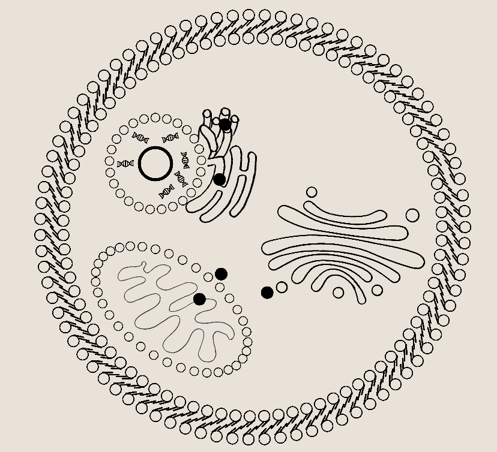

# NeuroCell
NeuroCell is a simulation of the workings of a general cell, but an AI controls the movement of molecules inside the cell, mainly to simulate glucose homeostasis.

Unity Version: 2022.3.17f1
#

